# MiniVess MLOps

> End-to-end MLOps pipeline for rodent cerebrovasculature segmentation from multiphoton fluorescence microscopy.

```mermaid
%%{init: {'theme': 'base', 'themeVariables': {'primaryColor': '#E8F4FD', 'primaryBorderColor': '#7BA7C9', 'primaryTextColor': '#2C3E50', 'secondaryColor': '#FDF2E9', 'secondaryBorderColor': '#D4A574', 'secondaryTextColor': '#2C3E50', 'tertiaryColor': '#EAFAF1', 'tertiaryBorderColor': '#82C9A1', 'tertiaryTextColor': '#2C3E50', 'lineColor': '#5D6D7E', 'textColor': '#2C3E50', 'background': '#FFFFFF', 'mainBkg': '#E8F4FD', 'nodeBorder': '#7BA7C9', 'clusterBkg': '#F8F9FA', 'clusterBorder': '#BDC3C7', 'fontSize': '14px'}}}%%
flowchart LR
    A[Raw Microscopy] --> B[Preprocessing]
    B --> C[Training]
    C --> D[Evaluation]
    D --> E[Deployment]

    style A fill:#FDF2E9,stroke:#D4A574
    style B fill:#E8F4FD,stroke:#7BA7C9
    style C fill:#E8F4FD,stroke:#7BA7C9
    style D fill:#E8F4FD,stroke:#7BA7C9
    style E fill:#EAFAF1,stroke:#82C9A1
```



## Overview

MiniVess MLOps provides a reproducible machine learning pipeline for segmenting rodent cerebrovasculature from in vivo multiphoton fluorescence microscopy images. The project wraps the MiniVess dataset in a full MLOps lifecycle -- from raw image ingestion through model training, evaluation, and containerized deployment -- with configuration-driven experiments managed via Hydra and experiment tracking via MLflow.

This is the companion code to the dataset published by Poon, Teikari et al. (2023) in Scientific Data.

## Key Features

- **Configuration-driven experiments** using Hydra YAML configs with hierarchical overrides
- **Reproducible training** with deterministic seeds, versioned data, and logged hyperparameters
- **Docker-based deployment** with separate images for environment setup, Jupyter exploration, and training
- **CI/CD pipelines** via GitHub Actions for automated Docker builds and integration tests
- **Experiment tracking** with MLflow and DagsHub integration
- **BentoML serving** for model inference packaging and deployment

## Quick Start

```bash
# Clone the repository
git clone https://github.com/petteriTeikari/minivess_mlops.git
cd minivess_mlops

# Build and run with Docker Compose
docker-compose -f deployment/docker-compose.yml up

# Or install locally with Poetry
poetry install

# Run training with default config
python src/run_training.py

# Run training with config overrides
python src/run_training.py +train_configs=your_config
```

## Project Structure

```
minivess_mlops/
├── src/
│   ├── datasets/          # Data loading and preprocessing
│   ├── training/          # Training loop and model definitions
│   ├── inference/         # Inference utilities
│   ├── log_ML/            # MLflow / experiment tracking
│   ├── utils/             # Shared utilities
│   ├── run_training.py    # Training entry point
│   └── run_inference.py   # Inference entry point
├── configs/               # Hydra configuration files
│   ├── defaults.yaml      # Base configuration
│   ├── train_configs/     # Training experiment configs
│   └── runmode_configs/   # Runtime mode configs
├── deployment/            # Docker and deployment artifacts
│   ├── Dockerfile         # Training image
│   ├── Dockerfile_env     # Environment image
│   ├── Dockerfile_Jupyter # Jupyter exploration image
│   └── docker-compose.yml
├── tests/                 # Test suite
├── notebooks/             # Exploratory Jupyter notebooks
└── tools/                 # Developer tooling
```

## Citation

If you use this pipeline or the MiniVess dataset, please cite:

```bibtex
@article{poon2023dataset,
  title={A dataset of rodent cerebrovasculature from in vivo multiphoton fluorescence microscopy imaging},
  author={Poon, Charissa and Teikari, Petteri and others},
  journal={Scientific Data},
  volume={10},
  pages={141},
  year={2023},
  publisher={Nature Publishing Group},
  doi={10.1038/s41597-023-02048-8}
}
```

## License

This project is licensed under the MIT License. See [LICENSE](LICENSE) for details.
